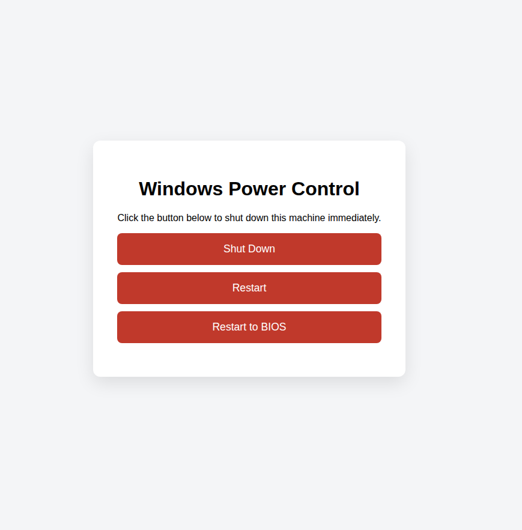

# WindowsControl

A minimal Go-powered web UI that exposes buttons to shut down, restart, or restart straight into BIOS/UEFI on the Windows machine it runs on. It can run interactively (for testing or ad-hoc use) or as a Windows Service so the HTTP endpoint is always available after boot. This is particularly handy for headless or hard-to-reach systems (rack servers, media centers, remote labs) where pressing the physical power button or entering BIOS locally would otherwise require hands-on access.



## Requirements

- Go 1.24 or newer (module sets toolchain to go1.24.11 automatically)
- Windows host if you intend to execute the actual shutdown command (tested on Windows 10/11; Windows 8+ is recommended for `/fw` firmware restarts, while shutdown/restart still work down to Windows 7)
- Administrator privileges when running interactively or installing the service (required for invoking `shutdown` and interacting with SCM)

## Running locally

```bash
go run .
# or
GOOS=windows go build -o windowscontrol.exe .
```

Browse to `http://localhost:8181` and use the **Shut Down**, **Restart**, or **Restart to BIOS** buttons. Handlers confirm every request and translate it into the relevant Windows `shutdown` command. Choose one of the delay presets (immediately, 30s, 2m, 5m, 30m) or enter a custom number of minutes to schedule the action instead of triggering it right away.

- **Restart** runs `shutdown /r /t 0` to reboot instantly.
- **Restart to BIOS** runs `shutdown /r /fw /t 0`, which only works on UEFI-capable systems and instructs Windows to enter the firmware configuration UI on the next boot.

All POST endpoints (`/shutdown`, `/restart`, `/restart-bios`) accept an optional JSON body `{"delaySeconds": N}`. Values default to `0`, and negative numbers are rejected.

On non-Windows hosts the endpoints respond with a message indicating that power control is unavailable. If you need to trigger these actions remotely, place the host on a [Tailscale](https://tailscale.com) tailnet (or a similar zero-trust overlay) so you can reach the HTTP UI over an encrypted WireGuard tunnel without exposing the shutdown/restart controls to the public internet.

## Prebuilt downloads

Every tagged release (`v*`) automatically builds `windowscontrol.exe` through GitHub Actions. Download the latest binary directly from the [GitHub Releases page](../../releases) if you don't want to build it yourself.

## Running as a Windows Service

1. Build the Windows binary on or for the target host:
   ```bash
   GOOS=windows GOARCH=amd64 go build -o windowscontrol.exe .
   ```
2. Copy the executable into the desired directory.
3. From an elevated PowerShell or Command Prompt, register the service (name must match the `serviceName` constant `WindowsControl`):
   ```powershell
   sc.exe create WindowsControl binPath= "C:\path\to\windowscontrol.exe" start= auto
   sc.exe description WindowsControl "Web UI to manage this machine"
   ```
4. Start it:
   ```powershell
   sc.exe start WindowsControl
   ```
5. Stop/remove when needed:
   ```powershell
   sc.exe stop WindowsControl
   sc.exe delete WindowsControl
   ```

The service host uses the same HTTP server internally and respects Stop/Shutdown commands from the Service Control Manager for a graceful exit.

## Development

- `go build ./...` to ensure the project compiles.
- `go test ./...` when you add tests.
- Modify `listenAddr` in `main.go` if you need to expose the server on another interface/port.

## License

Released into the public domain under [The Unlicense](UNLICENSE).
